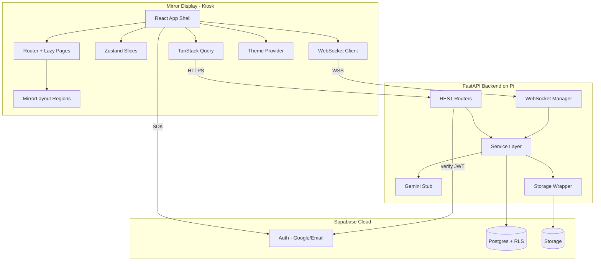

# Axon - AI Smart Mirror

Axon is a premium, AI-powered smart mirror designed to be installed in thousands
of homes. This workspace contains the **Phase 1 foundation**: a clean, scalable
architecture that future phases build on without major rewrites.

It is organized as **two independent repositories**:

- [`axon-frontend/`](axon-frontend/README.md) - React + Vite + TypeScript mirror UI
- [`axon-backend/`](axon-backend/README.md) - FastAPI backend + Supabase schema

> Phase 1 is **architecture + foundation only**. Voice, camera, face
> recognition, interview mode, music, and QR sharing are intentionally not
> implemented. Their seams (routes, events, state, tables) exist so later phases
> drop in cleanly.

## System architecture



## Quick start

Run the backend and frontend in two terminals.

```bash
# Terminal 1 - backend
cd axon-backend
python -m venv .venv && .venv\Scripts\activate
pip install -r requirements.txt
copy .env.example .env
uvicorn app.main:app --reload --port 8000

# Terminal 2 - frontend
cd axon-frontend
npm install
copy .env.example .env.local
npm run dev
```

Then apply the database migrations in `axon-backend/migrations/` (see that
folder's README).

## Key decisions (and why)

- **Two repos:** the mirror UI (browser kiosk) and the API (Pi service) have
  different runtimes, deploys, and dependency lifecycles.
- **Zustand + TanStack Query:** minimal re-renders for 60 FPS on the Pi; no
  Redux boilerplate; server state is cached, not duplicated.
- **CSS-variable theming:** adding a theme is one token block, never a code
  change.
- **Layered FastAPI:** thin routes, business logic in services, external systems
  behind wrappers - features land in one layer, not across the app.
- **Supabase Auth + RLS:** security enforced in the database, independent of
  client. The backend stays stateless by verifying JWTs.
- **Stable API/WS surface:** future features are documented `501` placeholders
  and reserved event types, so generated types and contracts don't churn.

## Phase 2 roadmap

1. Generate TypeScript types from the backend OpenAPI schema; wire real
   `/users` and `/settings` reads/writes against Supabase.
2. Sync the active theme to `settings.theme` per user.
3. Implement the Supabase **device-linking** flow (mirror shows a code from
   `device_codes`; a phone confirms).
4. Build the **Voice** feature module on the existing mic FSM + WebSocket events
   (wake word "Nexa", STT, TTS).
5. Add the **Daily AI Coach** using the `ai/gemini.py` wrapper and the `goals`
   table.
6. Add **Camera / Photos** (capture, storage uploads, QR sharing) and
   **Face Recognition** enrollment via `face_profiles`.
7. Add **InterviewGPT** sessions and **Music** playback.
8. CI/CD + Raspberry Pi kiosk deployment scripts and telemetry/logging.

## Phase 1 deliverables (in this repo)

1. Complete folder structure (frontend + backend)
2. Architecture diagram (above)
3. Database schema with relationships, indexes, RLS (`axon-backend/migrations/`)
4. REST API design (documented, OpenAPI at `/docs`)
5. WebSocket design (typed envelope + handler registry)
6. State management architecture (Zustand slices + TanStack Query)
7. Theme architecture (CSS-variable token sets)
8. Routing architecture (data router + lazy pages)
9. Authentication architecture (Supabase Auth + JWT verification)
10. Phase 2 roadmap (above)
